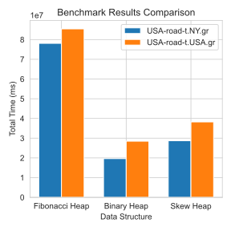

# Project Documentation

## Project Overview

This project focuses on implementing and benchmarking Dijkstra's algorithm in real-world scenarios. The goal is to evaluate the performance and efficiency of the algorithm with various data structures.

## Directory Structure

```sh
.
├── CMakeLists.txt
├── data # put the mentioned file in this directory
│   ├── USA-road-d.USA.co
│   ├── USA-road-d.USA.gr
│   ├── USA-road-t.NY.gr
│   └── USA-road-t.USA.gr
├── documents
│   └── doc.md
├── include
│   ├── binaryheap.hpp
│   ├── fiboheap.hpp
│   ├── heap.hpp
│   ├── pathfinder.hpp
│   └── skewheap.hpp
├── script
│   ├── nb.ipynb
│   └── run_test.sh
├── src
│   └── main.cpp
├── test
│   └── test_pop.cpp
└── test_cases
    ├── bench_ny # ln data/USA-road-t.NY.gr input.txt
    ├── bench_usa # ln data/USA-road-t.USA.gr input.txt
    ├── simplecase1
    └── simplecase2
```

## Getting Started

1. **Navigate to the project directory:**

    ```sh
    cd /home/flas/source/course/ads/dij_ds_realworld_bench/
    ```

2. **Build the project:**

    Use CMake to build the project. Run the following commands:

    ```sh
    mkdir build
    cd build
    cmake ..
    make
    ```

## A Introduction to Dijkstra

Dijkstra's algorithm, conceived by Dutch computer scientist Edsger W. Dijkstra in 1956, is a graph search algorithm that solves the single-source shortest path problem for a graph with non-negative edge weights. This algorithm is widely used in network routing protocols and geographic mapping applications.

### How It Works

1. **Initialization**: Start with the source node, setting its distance to zero and all other nodes to infinity. Mark all nodes as unvisited and set the source node as the current node.
2. **Visit Neighbors**: For the current node, consider all its unvisited neighbors and calculate their tentative distances through the current node. If the calculated distance is less than the known distance, update the shortest distance.
3. **Mark as Visited**: Once all neighbors of the current node are considered, mark the current node as visited. A visited node will not be checked again.
4. **Select Next Node**: Select the unvisited node with the smallest tentative distance as the new current node and repeat the process until all nodes are visited or the shortest path to the target node is found.

### Example

Consider a graph with nodes A, B, C, D, and E, and edges with the following weights:

```
A --1--> B --2--> C
|        |        |
4        3        1
|        |        |
D --1--> E --5--> D
```

Starting from node A, Dijkstra's algorithm will find the shortest path to all other nodes.

### Applications

- **Network Routing**: Used in routing protocols like OSPF (Open Shortest Path First) to find the shortest path for data packets.
- **Geographic Mapping**: Used in GPS systems to find the shortest route between locations.
- **Robotics**: Helps in pathfinding for autonomous robots navigating through environments.

Dijkstra's algorithm is a fundamental tool in computer science and operations research, providing efficient solutions to a wide range of shortest path problems.

## Heap

In the context of Dijkstra's algorithm, heaps are used to efficiently retrieve the node with the smallest tentative distance. Different types of heaps can be used, each with its own advantages and trade-offs.

### Binary Heap

A binary heap is a complete binary tree where each node is smaller than its children (min-heap) or larger than its children (max-heap). It supports efficient insertion, deletion, and retrieval of the minimum element.

- **Insertion**: O(log n)
- **Deletion**: O(log n)
- **Find Minimum**: O(1)

Binary heaps are simple to implement and provide good performance for many applications.

### Fibonacci Heap

A Fibonacci heap is a more complex data structure that consists of a collection of trees. It supports a more efficient decrease-key operation, which is particularly useful for Dijkstra's algorithm.

- **Insertion**: O(1)
- **Deletion**: O(log n)
- **Find Minimum**: O(1)
- **Decrease Key**: O(1) amortized

Fibonacci heaps can significantly improve the performance of Dijkstra's algorithm, especially for dense graphs.

### Skew Heap

A skew heap is a self-adjusting binary heap that allows for efficient merging of two heaps. It is simpler than a Fibonacci heap but can still offer good performance for certain operations.

- **Insertion**: O(log n) amortized
- **Deletion**: O(log n) amortized
- **Find Minimum**: O(1)
- **Merge**: O(log n) amortized

Skew heaps are useful when frequent merging of heaps is required.

Each of these heap implementations has its own strengths and can be chosen based on the specific requirements of the application.

### Benchmark results

On the dataset USA-road-t.NY.gr, we perform a test with 1000 query pairs.

| Data Structure | Total Time  (ms) |
|----------------|------------------|
| Fibonacci Heap |78094146|
| Binary Heap    |19631266|
| Skew Heap      |28728412|

On the dataset USA-road-t.USA.gr, which is 1.5 GiB in size, we perform a test with 10 query pairs. Due to the large size of the data and the limitations of CPU cache, these algorithms run much slower. Therefore, we have to choose a much smaller number of tests. Further optimization regarding cache management and parallelism may be required to perform a test with 1000 query pairs.

| Data Structure | Total Time  (ms) |
|----------------|------------------|
| Fibonacci Heap |85430305|
| Binary Heap    |28471819|
| Skew Heap      |38242873|



### Conclusion

#### Findings

From the benchmark results, we can draw the following conclusions regarding the performance of Dijkstra's algorithm with different heap implementations:

1. **Binary Heap** consistently outperforms both the **Fibonacci Heap** and **Skew Heap** in terms of total execution time across both datasets. This is somewhat surprising given that Fibonacci heaps theoretically offer better performance for the decrease-key operation, which is crucial in Dijkstra's algorithm. However, the overhead of maintaining the more complex structure of a Fibonacci heap seems to outweigh its theoretical advantages in practice, especially for real-world datasets.

2. **Fibonacci Heap** performs the worst in both datasets, despite its theoretical advantages. This suggests that the constant factors and the complexity of maintaining the heap structure in practice make it less suitable for real-world applications where cache efficiency and memory access patterns play a significant role.

#### Limitations

1. **Cache and Memory Management**: The performance of the Fibonacci heap, in particular, is likely affected by poor cache locality and memory overhead. The large size of the USA-road-t.USA.gr dataset (1.5 GiB) exacerbates this issue, as the data structures cannot fit entirely in the CPU cache. This leads to frequent cache misses and slower memory access, which significantly impacts performance. Future work could explore optimizations such as cache-aware data structures or parallelism to mitigate these issues.

2. **Real-world Graph Characteristics**: The datasets used in this benchmark are road networks, which have specific characteristics such as sparsity and locality. The performance of the heaps may differ for other types of graphs, such as dense graphs or graphs with different topological properties. Further testing on a wider variety of graph types would provide a more general understanding of the performance of these data structures.
